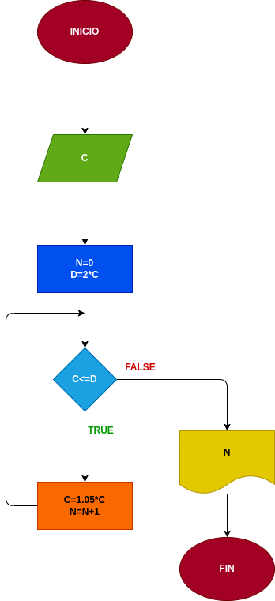

# Interes_Compuesto
Hacer el diagrama de flujo y el programa en python, que lea un capital c, y que averigue e imprima en cuantos meses se duplica si lo colocamos a un interes compuesto del 5% mensual

# input

C=valor inicial

# processing
N=numero de meses

D=el valor ya duplicado
# output

Valor final

Numero de meses en el que se duplico el dinero

# diseño

